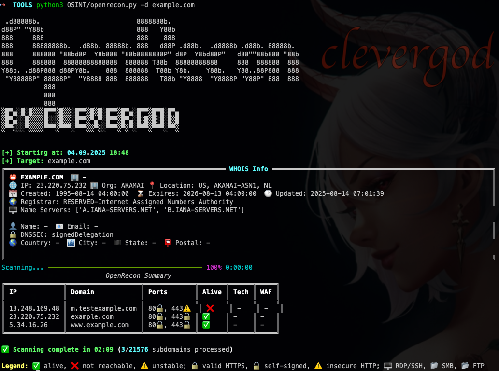

# 🛰️ OpenRecon — Asynchronous Reconnaissance Tool for Domain Enumeration

```
 .d88888b.                         8888888b.
d88P" "Y88b                        888   Y88b
888     888                        888    888
888     88888888b.  .d88b. 88888b. 888   d88P .d88b.  .d8888b .d88b. 88888b.
888     888888 "88bd8P  Y8b888 "88b8888888P" d8P  Y8bd88P"   d88""88b888 "88b
888     888888  88888888888888  888888 T88b  88888888888     888  888888  888
Y88b. .d88P888 d88PY8b.    888  888888  T88b Y8b.    Y88b.   Y88..88P888  888
 "Y88888P" 88888P"  "Y8888 888  888888   T88b "Y8888  "Y8888P "Y88P" 888  888
           888
           888
           888
░█▀▄░█░█░░░█▀▀░█░░░█▀▀░█░█░█▀▀░█▀▄░█▀▀░█▀█░█▀▄
░█▀▄░░█░░░░█░░░█░░░█▀▀░▀▄▀░█▀▀░█▀▄░█░█░█░█░█░█
░▀▀░░░▀░░░░▀▀▀░▀▀▀░▀▀▀░░▀░░▀▀▀░▀░▀░▀▀▀░▀▀▀░▀▀░
```

**OpenRecon** is a high-performance asynchronous reconnaissance tool built for rapid subdomain enumeration, port scanning, CDN detection, and WAF identification.



---

## ✅ Features

- 🔎 Subdomain enumeration via crt.sh, Chaos, Subfinder
- 🌐 Multi-port scanning (80, 443, 8080, 8081, 8443, etc.)
- 🔐 HTTPS Certificate Validation (🔒 valid, 🔓 self-signed, ⚠️ insecure)
- 🧱 WAF Detection (FortiWeb, Cloudflare, etc.)
- 📡 Real IP detection behind CDN
- ✨ Visual terminal output with icons and colors
- 📁 Export results to CSV, JSON, TXT
- 🧵 Multi-threaded and asynchronous
- 💡 Easy to use: single script, no Docker needed

---

## ⚙️ Installation

### Recommended (via `pipx`)
```bash
pipx install git+https://github.com/cleverg0d/OpenRecon.git
```

### Manual
```bash
git clone https://github.com/cleverg0d/OpenRecon.git
cd openrecon
pip install -r requirements.txt
```

---

## 🚀 Usage

```bash
python3 openrecon.py -d example.com
```

### Options
```
-d, --domain DOMAIN       Target domain to scan
-w, --wordlist WORDLIST   Subdomain wordlist path (for brute mode)
-t, --threads THREADS     Number of threads (default: 10)
-f, --full                Enable full scanning (WAF, real IP, DNS)
-o, --output OUTPUT       Export result path
--debug                   Enable verbose output
-h, --help                Show this message
```

---

## 📦 Output

- Markdown summary
- JSON structure
- CSV table
- Per-category TXT lists (if raw mode enabled)

---

## 🧠 Author

Stanislav Istyagin ([@clevergod](https://t.me/clevergod))  
Cybersecurity Expert | Red Teamer | SOC Analyst

---

## 📜 License

MIT License
